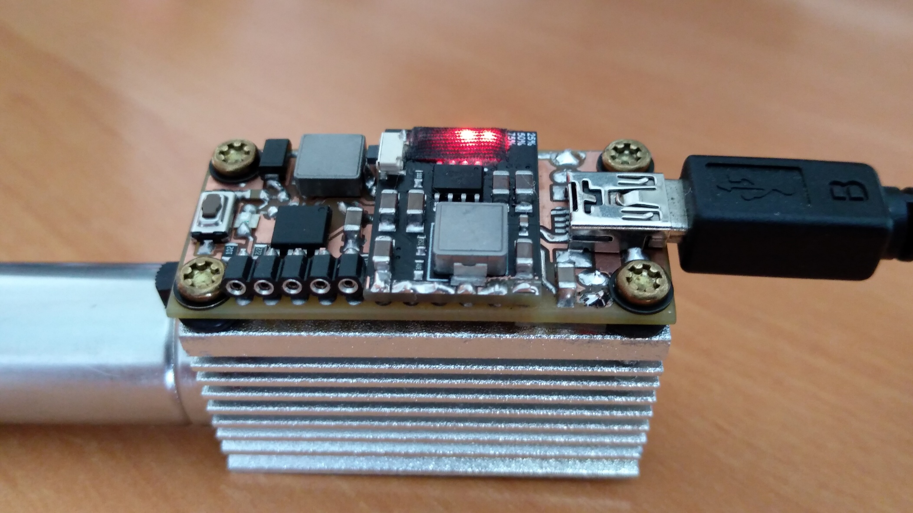

# 2W LASER - M140 Nichia

Construction of a driver for this small diode, power by 18650 battery.
- Max output = 4.8V 2A
- 4 Selectable power levels (0.1-0.5-1.0-1.5A)
- Constant CC with soft start
- Battery monitoring in charge and discharge

Firmware: Bascom AVR 2.0.8.1; Layout: CadSoft EAGLE 6.5.0

*Stay creative (& always wear safety glasses)
